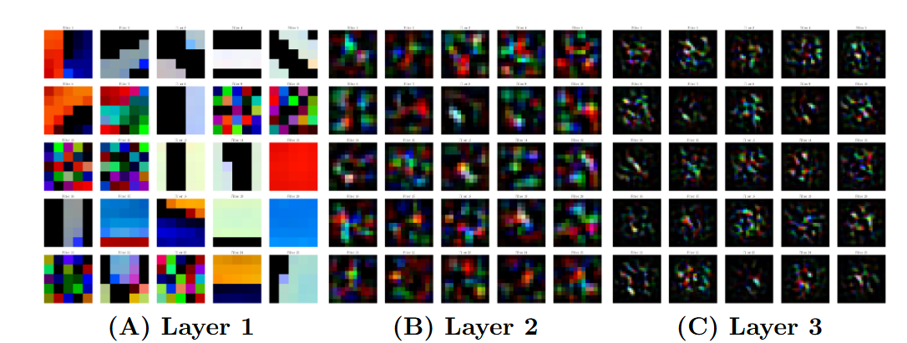
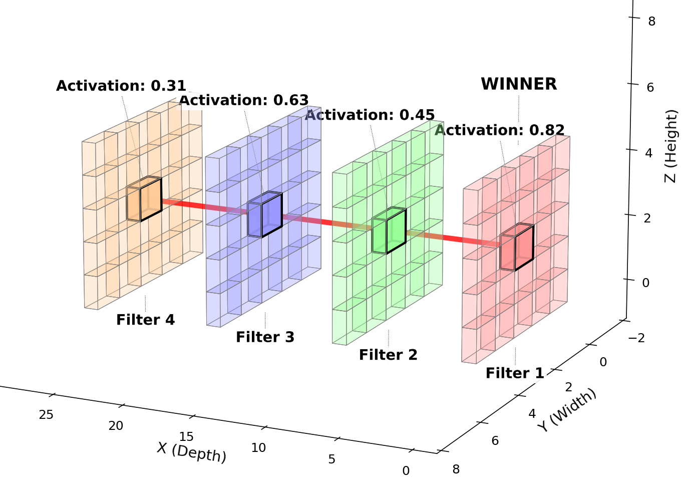
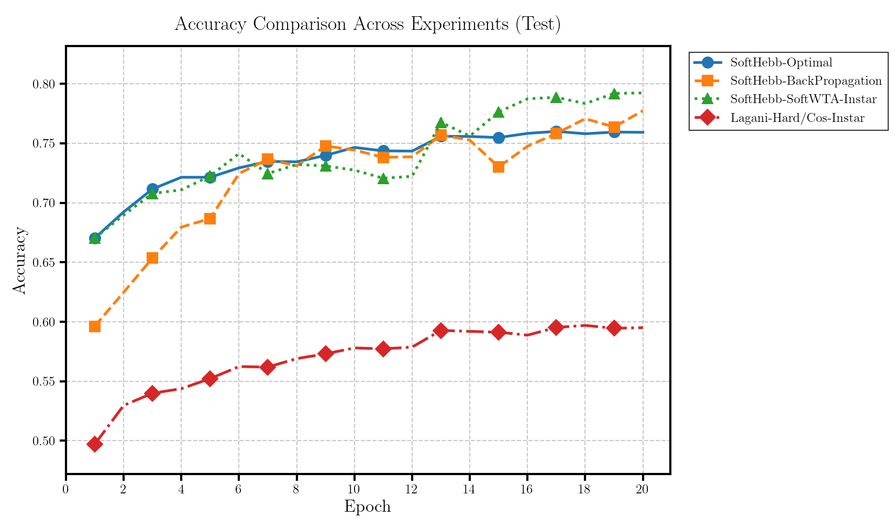
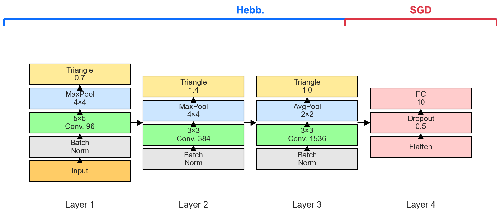
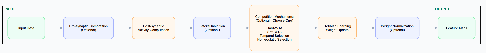

# Advancing the Biological Plausibility and Efficacy of Hebbian Convolutional Neural Networks

This repository contains an implementation of a biologically-plausible deep learning framework that advances the state-of-the-art in Hebbian learning for Convolutional Neural Networks (CNNs). The framework achieves 76% accuracy on CIFAR-10 through careful integration of biologically-inspired mechanisms while maintaining competitive performance with backpropagation-based approaches. This model used a two-phase training approach: unsupervised Hebbian learning for feature extraction in convolutional layers, followed by a supervised classifier layer trained via backpropagation.

Please refer to our paper **Advancing the Biological Plausibility and Efficacy of Hebbian Convolutional Neural Networks** for further theoretical and practical details. Our work builds upon previous contributions in Hebbian learning, including the SoftHebb architecture [Journé et al. 2022], foundational work on Hebbian CNNs with Hard-WTA [Amato et al. 2019], [Grinberg et al. 2019], and modern Hebbian gradient integration [Miconi 2021].


*Figure 1: PGA Receptive fields for first 25 neurons at each layer of the SoftHebb-Optimal
configuration. Note the increasing hierarchical complexity of the patterns at each layer.*

## Key Features

The framework implements several key innovations in Hebbian learning in CNNs, implemented as independent mechanisms which can be enabled or disabled:

- Soft and Hard Winner-Takes-All (WTA) competition
- Fully local Hebbian learning rules computationally optimized without gradients
- Novel Additions:
  - BCM (Bienenstock-Cooper-Munro) learning rule integration 
  - Lateral inhibition mechanisms modeling cortical processing
  - Different competition models: temporal, homeostatic, presynaptic
  - Depthwise separable convolutions reducing parameters by 6.6x
  - Residual blocks using depthwise separable convolutions
  - Dale's Principle implementation for biological realism
- Multiple previous published SOTA Hebbian-CNN models ([Journé et al. 2022],  [Amato et al. 2019])
- End-to-end backpropagation trainable SoftHebb architecture
- Comprehensive evaluation framework for analyzing neural competition
- Modular, Pytorch-like design for ease of use and future improvements


*Figure 2: Diagram of Hebbian Hard-WTA competition in a CNN layer*

## Performance

The framework achieves:
- 76% test accuracy on CIFAR-10 (3-layer CNN)
- 11.4% improvement over previous hard-WTA SOTA approach (64.6%) with same depth (Miconi et al)
- Significant improvement over previous Hard-WTA approaches: Amato et al's 3-layer network (59.7%), and Grinberg et al's 1-layer network (72.2%)
- Comparable performance to backpropagation (77%)
- 6.6x parameter reduction with depthwise convolutions while preserving high accuracy (72%)

## Pre-configured Versions

Our paper evaluated several configurations, available as preset versions:

### Primary Configurations
- `optimal`: Our optimal configuration combining BCM learning with lateral inhibition (76% on test set for CIFAR-10)
- `dale`: Biologically realistic version respecting Dale's Principle (67.3% CIFAR-10)
- `hard_basic`: Basic Hard-WTA baseline (74.8% CIFAR-10)
- `soft`: Reproduces SoftHebb implementation [Journé et al. 2019] (79.2% CIFAR-10)

### Experimental Configurations
- `bcm`: Pure BCM learning (75.3% CIFAR-10)
- `temporal`: Temporal competition (74.6% CIFAR-10)
- `adaptive`: Threshold-based Homeostatic competition (68.5% CIFAR-10)
- `presynaptic`: Presynaptic competition (65.1% CIFAR-10)


*Figure 3: Accuracy values during test for Lagani-Hard/Cos-Instar (red), SoftHebb-SoftWTA-
Instar (green), SoftHebb-Backpropagation (orange), and SoftHebb-Optimal (blue)*

## Configuration

## Hebbian Learning Parameters

The framework uses a comprehensive configuration system to control learning dynamics and network architecture. Here are the complete parameters:

### Core Learning Parameters
- `mode`: Configuration type ('hard', 'soft', 'bcm', 'temp', 'thresh', 'basic')
- `alpha`: Backpropagation gradients influence over Hebbian updates (default 1.0 where only Hebbian updates occur)
- `lr`: Base learning rate (default 0.1)
- `w_nrm`: Weight normalization flag
- `act`: Activation function post-convolution

### Competition Parameters  
- `use_cosine_similarity`: Uses cosine similarity activation function
- `use_lateral_inhibition`: Enables surround lateral inhibition modulation
- `top_k`: Number of winning neurons (default 1)
- `t_invert`: Temperature for soft competition
- `competition_type`: Competition mechanism ('hard', 'soft')
- `competition_k`: Competition Homeostatic strength factor (default 2)
- `temporal_window`: Window size for temporal competition (default 500)
- `use_presynaptic_competition`: Enables competition between input features
- `presynaptic_competition_type`: Competition method for presynaptic competition ('lp_norm', 'softmax')

### Plasticity Parameters
- `use_homeostasis`: Enables homeostatic plasticity

### Lateral Inhibition Parameters
- `sigma_e`: Excitatory Gaussian sigma (default 1.2)
- `sigma_i`: Inhibitory Gaussian sigma (default 1.4)
- `lateral_kernel`: Kernel size for lateral inhibition (default 5)

### BCM Parameters
- `bcm_theta`: BCM threshold decay rate (default 0.5)
- `theta_decay`: Threshold adaptation rate

### Weight Parameters
- `init_method`: Weight initialization ('kaiming_uniform', 'softhebb')
- `dale`: Enforces Dale's Principle

## Architecture Options

The framework supports four main architectures:


*Figure 4: Overview of the SoftHebb Hebbian CNN architecture*

### SoftHebb (Default)
- 3-layer CNN with padding
- Channel progression: 96 -> 384 -> 1536
- Triangle activation function
- 5.9M parameters

### SoftHebb Depthwise
- Separable convolutions for efficiency
- Same channel progression as SoftHebb
- Reduces parameters by 6.6x (0.9M total)
- Exhibits biological center-surround patterns

### SoftHebb Residual
- Adds skip connections and uses inverted bottleneck separable convolutions
- 4.03M parameters
- Maintains accuracy while improving information flow

### Lagani ([Amato et al. 2019])

- Padding-free design
- Moderate channel scaling: 96 -> 128 -> 192 (-> 256)
- Available in short (3-layer) and deep (4-layer) variants
- 0.39M parameters (short), 0.8M parameters (deep)
- Performance: 59.7% (short), 52.8% (deep)

Configuration and Architecture usage:
```python
config = get_hebbian_config(version="best")
model = HebbianCNN(
    architecture="depthwise",
    init_channels=96,
    n_layers=3,
    **config
)
```
## Project Structure

The repository is organized into several key directories:

### models/
Contains the core model architecture implementations:
- `Model_BackProp.py`: Standard CNN with backpropagation
- `model_depthwise.py`: Depthwise separable CNN architecture
- `model_hebb.py`: Base Hebbian CNN implementation
- `model_residual.py`: Residual Hebbian CNN architecture

### experiment/
Houses the training and evaluation infrastructure. Run these files to start experiments:
- `experiment_bp.py`: Backpropagation training pipeline
- `experiment_hebbian.py`: Core Hebbian learning experiments
- `experiment_hebbian_depthwise.py`: Training for depthwise variant
- `experiment_hebbian_residual.py`: Training for residual variant

### hebbian_layers/
Implements the fundamental Hebbian-CNN layer components, with different Hebbian learning rules and competition mechanisms:
- `hebb.py`: Core Hebbian layer implementation
- `hebb_depthwise.py`: Depthwise separable Hebbian convolutions


*Figure 5: Diagram of the Hebbian learning process in our custom Hebbian-CNN layer. Green
boxes correspond to input/output, blue boxes indicate optional processing, and orange boxes
deesignate core learning and competition mechanisms*


### visualisation/
Provides comprehensive visualization tools:
- `accuracy_plot.py`: Training/validation accuracy curves plot
- `heatmap_activations.py`: Neural activation heatmaps
- `image_receptive_fields.py`: Receptive field visualization given image
- `learning_diagram.py`: Learning process diagram 
- `receptive_fields.py`: PGA receptive field analysis
- `receptive_fields_residual.py`: PGA receptive field analysis for residual block
- `softhebb_plot.py`: SoftHebb-specific architecture plot
- `top_receptive_fields.py`: Top-activation receptive fields given image (whole image visible)
- `visualizer.py`: General visualization utilities (weight distribution, metrics)
- `whole_image_receptive_field.py`: Receptive fields with whole image for context 
- `wta_plot.py`: Winner-Takes-All competition diagram
- 
### hebbian_config.py

Controls the Hebbian Learning, Competition, Plasticity, Lateral Inhibition, BCM and Weight parameters

## Requirements

Installation requirement can be found in requirements.txt. To allow functional imports of files from different directories, please set the Hebbian_Code folder as Root Directory.

## Citation

If you use this framework in your research, please cite:

```
@article{nimmo2024advancing,
  title={Advancing the Biological Plausibility and Efficacy of Hebbian Convolutional Neural Network},
  author={Nimmo, Julian Jimenez and Mondragon, Esther},
  journal={Preprint},
  year={2024}
}
```

## Contributing

We welcome contributions to improve Hebbian biological plausibility in Neural Networks, scaling capabilities, and computational efficiency. Please submit issues and pull requests following standard guidelines.

## License

This project is available under Apache-2.0 license

For more details on the implementation and theoretical background, please refer to the accompanying paper.

## References
```
@inproceedings{journe2022hebbian,
  title={Hebbian Deep Learning Without Feedback},
  author={Journ{\'e}, Adrien and Rodriguez, Hector Garcia and Guo, Qinghai and Moraitis, Timoleon},
  year = 2022,
  booktitle={The Eleventh International Conference on Learning Representations}
}

@inproceedings{amato2019hebbian,
  title={Hebbian learning meets deep convolutional neural networks},
  author={Amato, Giuseppe and Carrara, Fabio and Falchi, Fabrizio and Gennaro, Claudio and Lagani, Gabriele},
  booktitle={Image Analysis and Processing--ICIAP 2019: 20th International Conference, Trento, Italy, September 9--13, 2019, Proceedings, Part I 20},
  pages={324--334},
  year={2019},
  organization={Springer}
}

@inproceedings{grinberg2019local,
  title={Local Unsupervised Learning for Image Analysis},
  author={Grinberg, Leopold and Hopfield, John and Krotov, Dmitry},
  year={2019},
  booktitle={Real Neurons Hidden Units: Future directions at the intersection of neuroscience and artificial intelligence@ NeurIPS 2019}
}

@article{miconi2021hebbian,
  title={Hebbian learning with gradients: Hebbian convolutional neural networks with modern deep learning frameworks},
  author={Miconi, Thomas},
  journal={arXiv preprint arXiv:2107.01729},
  year={2021}
}
```